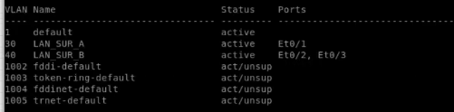
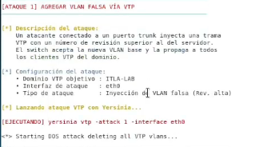
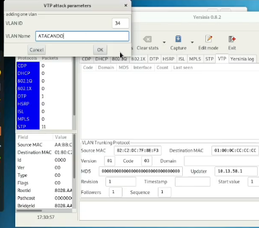
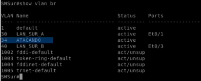
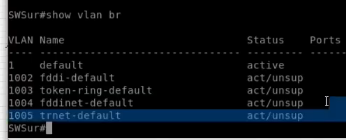

# INFORME TÉCNICO: ATAQUE AL PROTOCOLO VTP (VLAN TRUNKING PROTOCOL)
## Materia: Seguridad de Redes (TSI-203)
**Profesor:** Jonathan Esteban Rondon Corniel  
**Estudiante:** Alan Daniel Garcia Mendez  
**Matrícula:** 2025-1403  
**Carrera:** Seguridad Informática (TSI)  
**Institución:** Instituto Tecnológico de Las Américas (ITLA)  
**Fecha:** 12 de junio de 2026  
**Video Demostrativo (Paso a Paso):** [Ver en YouTube (https://youtu.be/4D-v5ixCxUo)](https://youtu.be/4D-v5ixCxUo)

---

## 🎬 Demostración en Video

El desarrollo completo de este ataque y su posterior mitigación en los switches Cisco se detalla en el siguiente video:

> 📺 **Enlace de YouTube:** [VTP Attack — Agregar/Borrar VLAN | Alan Daniel Garcia](https://youtu.be/4D-v5ixCxUo)

---

## 📋 1. Objetivo del Laboratorio

Demostrar la debilidad intrínseca del protocolo **VTP (VLAN Trunking Protocol)** en sus versiones 1 y 2 cuando opera en configuraciones por defecto (sin autenticación). El laboratorio tiene como fin ilustrar cómo un atacante con acceso a un puerto troncal puede manipular de forma centralizada la base de datos de VLANs de un dominio completo, lo que puede provocar interrupción del servicio (DoS) o fugas de información.

---

## 💻 2. Objetivo y Funcionamiento del Script (`AlanGarcia_2025-1403_vtp_attack_P4.sh`)

El script `AlanGarcia_2025-1403_vtp_attack_P4.sh` es una herramienta de automatización diseñada para entornos de laboratorio en Kali Linux. Su propósito es interactuar con la herramienta de red `yersinia` y capturar simultáneamente el tráfico con `tcpdump` para análisis forense.

### ¿Cómo funciona el ataque a nivel de protocolo?
VTP sincroniza la base de datos de VLANs entre switches Cisco utilizando mensajes de tipo **VTP Summary Advertisements**. Estos mensajes contienen:
1. El **Nombre del Dominio VTP**.
2. El **Número de Revisión de Configuración** (Configuration Revision Number), un contador entero de 32 bits que se incrementa en `1` cada vez que se agrega, borra o modifica una VLAN.
3. El Hash MD5 calculado (si hay contraseña configurada).

Cuando un switch Cisco recibe una trama VTP con el mismo dominio y una firma válida, compara el número de revisión del mensaje con el de su base de datos local. **Si el número de revisión recibido es estrictamente mayor**, el switch descarta su propia base de datos y aplica la información recibida, propagándola a su vez por todos sus enlaces troncales activos.

El script realiza dos modalidades de ataque:
1. **Inyección de VLAN Falsa (Ataque 1):** Inyecta tramas de anuncio VTP con un número de revisión elevado que añade una VLAN arbitraria (ej. VLAN 666 o similar) a la base de datos global.
2. **Borrado de la Base de Datos (Ataque 2 - DoS):** Inyecta tramas de anuncio con un número de revisión muy alto (cercano al límite) y una lista vacía de VLANs. Esto obliga a todos los switches (servidores y clientes VTP) a borrar todas sus VLANs activas. Al no existir las VLANs en la base de datos del switch, todos los puertos asociados quedan inactivos de manera inmediata, dejando a los usuarios legítimos sin conectividad de red.

---

## ⚙️ 3. Parámetros del Script y Requisitos

### Requisitos del Sistema
* **Sistema Operativo:** Kali Linux 2024.x o similar.
* **Herramientas requeridas:**
  * `yersinia` (Suite de ataques de capa 2).
  * `tcpdump` (Capturador de tramas de red).
  * `iproute2` (Herramientas básicas de red en Linux).
* **Conectividad:** La tarjeta de red del atacante (por ejemplo, `eth0`) debe estar directamente conectada a un puerto del switch que esté operando como **Enlace Troncal (Trunk)**, o bien se debe forzar la creación de un trunk mediante DTP antes del ataque.

### Parámetros Configurables
Dentro del script [AlanGarcia_2025-1403_vtp_attack_P4.sh](AlanGarcia_2025-1403_vtp_attack_P4.sh) se pueden modificar las siguientes variables:
```bash
INTERFACE="eth0"                 # Interfaz física del atacante conectada al switch
VTP_DOMAIN="ITLA-LAB"            # Nombre del dominio VTP configurado en la red objetivo
CAPTURE_FILE="vtp_capture.pcap"  # Nombre de la captura de tráfico para análisis en Wireshark
```

---

## ⚡ 4. Guía de Ejecución y Evidencia Práctica

### Paso 1: Estado Inicial del Switch (Estado Normal)
Antes de realizar el ataque, la tabla de VLANs del switch objetivo (`SWSur`) se encuentra en su estado normal, mostrando las VLANs legítimas configuradas en la topología (VLAN 30 para `LAN_SUR_A` y VLAN 40 para `LAN_SUR_B`):


*Salida de show vlan br en el switch: Muestra el estado operativo de las VLANs legítimas de la sede Sur antes de sufrir alteración.*

---

### Paso 2: Ejecución del Script y Configuración del Ataque
Iniciamos el script interactivo `AlanGarcia_2025-1403_vtp_attack_P4.sh` en Kali Linux para lanzar las inyecciones de tramas VTP. El script permite configurar los parámetros del ataque e invocar a Yersinia en segundo plano:


*Consola de Kali Linux: Ejecución del script y selección de la interfaz de ataque y parámetros del protocolo.*

Para el **Ataque 1**, se definen los parámetros de la VLAN maliciosa (ID 34, nombre "ATACANDO") que se inyectará en el dominio VTP:


*Configuración en Yersinia: Parámetros del ataque para añadir la VLAN maliciosa con un número de revisión superior.*

---

### Paso 3: Validación de VLAN Agregada (Ataque 1)
Una vez que Yersinia inyecta el anuncio VTP Summary con el número de revisión incrementado, los switches del dominio actualizan su base de datos local y propagan el cambio. Al consultar el switch `SWSur`, se puede comprobar que la VLAN 34 ("ATACANDO") ha sido agregada con éxito de forma no autorizada:


*Salida de show vlan br: Confirmación en el switch de que la VLAN maliciosa 34 ha sido agregada dinámicamente mediante la inyección del anuncio.*

---

### Paso 4: Validación de Denegación de Servicio - VLANs Borradas (Ataque 2)
Para el **Ataque 2**, se envía un anuncio VTP con un número de revisión extremadamente alto y una lista vacía de VLANs. Esto obliga a todos los switches (servidores y clientes) a sincronizarse con esta base de datos vacía, eliminando instantáneamente todas las VLANs configuradas y dejando a los puertos asociados huérfanos e inactivos (DoS):


*Salida de show vlan br: Wiping completo de la base de datos de VLANs del switch. Las VLANs legítimas (30, 40) y la maliciosa (34) han sido eliminadas, provocando la pérdida total de conectividad en los puertos de usuario.*

---

## 🗺️ 5. Documentación de la Red de Laboratorio

El laboratorio fue diseñado y emulado en PNETLab utilizando la siguiente arquitectura de red:


*PNETLab Topology: Muestra la interconexión entre el Router Central (RCentral), Routers de sedes (RNorte, RSur), los switches locales (SWNorte, SWSur) y las máquinas de ataque y víctimas.*

* **Switch Server (SW1):** Switch principal que tiene el rol de servidor VTP en el dominio `ITLA-LAB`.
* **Switch Client (SW2):** Switch cliente sincronizado automáticamente a través de un enlace troncal 802.1Q con SW1.
* **Dispositivo de Ataque:** Kali Linux conectado al switch SW1.

### Configuración Vulnerable (Antes del Ataque)
El archivo [AlanGarcia_2025-1403_sw1_before_P4.txt](configs/AlanGarcia_2025-1403_sw1_before_P4.txt) detalla el estado vulnerable inicial de los switches:
* **VTP habilitado en modo Server/Client** (versión 1 o 2).
* **Sin contraseña VTP establecida.**
* **Enlaces troncales sin configuraciones de seguridad adicionales.**

---

## 🛡️ 6. Contra-medidas y Mitigación

Para proteger la infraestructura frente a la inyección y manipulación de tramas VTP, se aplican técnicas de endurecimiento (Hardening) que se reflejan en el archivo de configuración segura [AlanGarcia_2025-1403_sw1_after_P4.txt](configs/AlanGarcia_2025-1403_sw1_after_P4.txt).

### Comandos de Configuración en Cisco IOS

<div class="article-block">

#### A. Mitigación Óptima: Desactivar VTP o usar Modo Transparent
La práctica más recomendada a nivel empresarial es no depender de VTP para la propagación dinámica de VLANs, configurando los switches en modo transparente (donde solo reenvían mensajes pero no aplican cambios) o desactivándolo por completo (en switches modernos).
```ios
SW1(config)# vtp mode transparent
! O en plataformas compatibles:
SW1(config)# vtp mode off
```

</div>

<div class="article-block">

#### B. Implementar Autenticación con Contraseña Segura
Si es estrictamente necesario el uso de VTP, se debe configurar una contraseña criptográfica MD5. Los mensajes VTP sin un hash que coincida con la contraseña serán ignorados.
```ios
SW1(config)# vtp password <Contraseña_Muy_Segura> secret
```

</div>

<div class="article-block">

#### C. Migración a VTP Versión 3 (VTPv3)
VTPv3 soluciona los problemas estructurales de las versiones anteriores. Introduce el concepto de **Primary Server** y **Secondary Server**. Solo un switch promovido manualmente a Primary Server puede hacer cambios en la base de datos de VLANs, impidiendo que cualquier dispositivo de terceros altere la red por poseer un número de revisión superior.
```ios
SW1(config)# vtp version 3
SW1# vtp primary vlan
```

</div>

<div class="article-block">

#### D. Deshabilitar Negociación Troncal (DTP) en Puertos del Switch
Evita que un puerto negociable se convierta en troncal, bloqueando la llegada de tramas de control VTP a través de puertos de acceso:
```ios
SW1(config-if)# switchport mode access
SW1(config-if)# switchport nonegotiate
```

> [!IMPORTANT]
> Aplicar estas mitigaciones garantiza que la base de datos de VLANs de los switches mantenga su integridad frente a inyecciones accidentales o maliciosas desde hosts conectados en los puertos de usuario.
</div>
